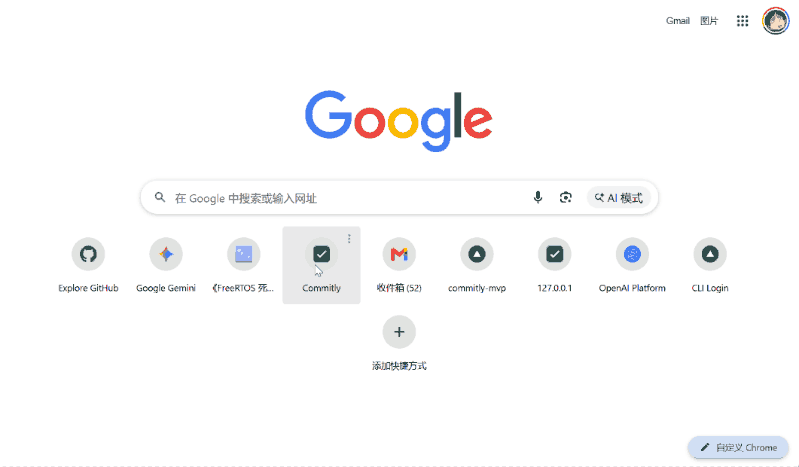

<p align="center">
  
</p>

# Commitly —— 别让承诺烂在聊天记录里

我大三。每学期 6 门课、2 个社团、无数次"我回头发你""周五前一定给"。

答应的事太多，忘了一半。于是花了两个月，在宿舍里从零写了 Commitly。

---

🚀 [在线体验] → https://commitly-mvp.vercel.app

## 它做什么

粘贴任何中文沟通文本 → 自动识别「我该做」和「你该做」→ 人工审核 → 按紧急程度分组 → 每天打开看板就知道该催什么、该做什么。

**不连 CRM，不接通讯工具，只做承诺追踪一件事。**

---

## 功能

- 🧠 **AI 提取**：粘贴会议纪要、邮件、聊天记录，自动识别承诺方向、负责人、截止日期和原文证据
- ✅ **人工审核**：删掉误判项，修正提取结果，确认后再进入看板——AI 初筛，人做决策
- 📋 **看板追踪**：按「今日到期 / 已逾期 / 我欠别人 / 别人欠我 / 无日期 / 已完成」分组，一眼看清
- 📧 **每日简报**：配置 Resend 后，自动发送当日到期和跟进的承诺摘要
- 🌙 **暗夜主题**：纯 CSS 玻璃拟态 + 渐变网格背景 + 粒子氛围动画

---

## 快速开始

```bash
git clone https://github.com/Aqiu591/commitly-mvp.git
cd commitly-mvp
cp .env.example .env.local
# 编辑 .env.local，填入 Supabase + OpenAI API Key
npm install
npm run dev
```

---

## 技术栈

| 层级 | 技术 |
|------|------|
| 框架 | Next.js 15 (App Router) |
| 数据库 & 认证 | Supabase (PostgreSQL + Row Level Security) |
| AI 提取 | OpenAI Responses API · strict JSON Schema |
| 邮件 | Resend |
| 测试 | Vitest（单元 / 集成 / AI eval） |
| 类型校验 | TypeScript + Zod |
| 设计 | 暗夜玻璃拟态 · CSS Custom Properties · Geist Variable Font |

---

## 项目结构

```
src/
├── app/            # Next.js App Router 页面 & API
│   ├── api/        # REST API 路由
│   ├── dashboard/  # 看板页
│   ├── new/        # 新建承诺（导入 + 手动）
│   ├── review/     # AI 提取结果审核
│   └── login/      # 登录（模态弹窗）
├── components/     # React 组件
├── lib/            # 业务逻辑
│   ├── ai/         # OpenAI 交互 & Prompt
│   ├── commitments/ # 状态机 & 字段映射
│   ├── supabase/   # 服务端/客户端/Admin 三端
│   └── email/      # 每日简报
├── tests/          # 55 个测试用例
└── supabase/       # 数据库迁移 & RLS 策略
```

---

## License

MIT —— 随便用，随便改。

---

## 关于作者

大三学生，一边上课一边写代码。这是我在宿舍里从零搭建的第一个完整项目。

如果能帮到你，点个 ⭐ 我会很开心。如果能提 issue 或 PR，我会更开心。

- GitHub: [@Aqiu591](https://github.com/Aqiu591)
